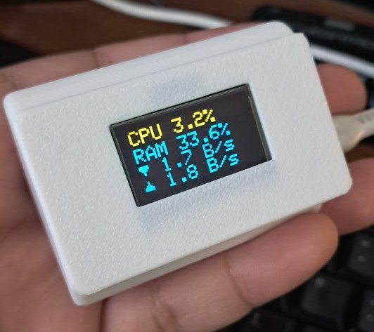

# ESP32 OLED ServerStats from Netdata



This project allows an ESP32 microcontroller with a small OLED display to fetch and show system metrics from a FastAPI backend. The backend collects CPU, RAM, and network statistics and exposes them via an API endpoint (`/espdata`).  

The project is designed as a **single-container setup** using Docker. In this setup, **Netdata** is used as the source of metrics to study API calls, but other options like **psutil** can also be used.

---

## Features

- ESP32 OLED display shows real-time system metrics:
  - CPU usage
  - RAM usage (used, total, and percentage)
  - Network traffic (incoming/outgoing)
- FastAPI backend serves JSON metrics over HTTP
- Single-container Docker setup for easy deployment
- Compatible with other monitoring tools besides Netdata (e.g., psutil)

---

## Folder Structure

ESP32_OLED_ServerStats/
├─ app.py # FastAPI backend
├─ requirements.txt # Python dependencies
├─ Dockerfile # Docker setup
├─ ESP32/
│ ├─ ESP32_OLED.ino # Arduino sketch for ESP32
│ ├─ README.md

> The `ESP32/` folder contains your microcontroller firmware. The root folder holds the backend Docker container.

---

## Setup

### Docker (Recommended)

1. Build the Docker image:

``` bash
docker build -t esp32-serverstats . 
```

2. Run the container:

``` bash
docker run -d -p 8080:8080 esp32-serverstats
```

3. The API will be available at:

``` bash
http://<host-ip>:8080/espdata
```

## Native Python (Optional)

1. Create a virtual environment and install dependencies:

``` bash
python -m venv venv
source venv/bin/activate  # Linux/macOS
venv\Scripts\activate     # Windows

pip install -r requirements.txt
```

2. Run the FastAPI server:

``` bash
uvicorn app:app --host 0.0.0.0 --port 8080
```

## API Example

Request
``` bash
GET /espdata
```

Example response:

``` json
{
  "cpu_total": "2.0%",
  "ram_used": "2.32 GB",
  "ram_total": "7.66 GB",
  "ram_percent": "30.3%",
  "net_in": "0.4 B/s",
  "net_out": "0.4 B/s"
}
```
## ESP32 Bill of Materials

- Esp32 Devkit board
- 0.96" OLED Display
- Wires and soldering iron
- [3D printed case by B4nyonyo](https://makerworld.com/en/models/806010-esp32-oled-0-96-inch#profileId-746575)

## Notes

- Single-container setup is used for simplicity.

- Netdata is used in this repo as a metric source for experimentation.
- You can replace Netdata with `psutil` or other monitoring solutions with minimal changes.
- The ESP32 code reads the JSON from /espdata and displays it on the OLED in real time.


